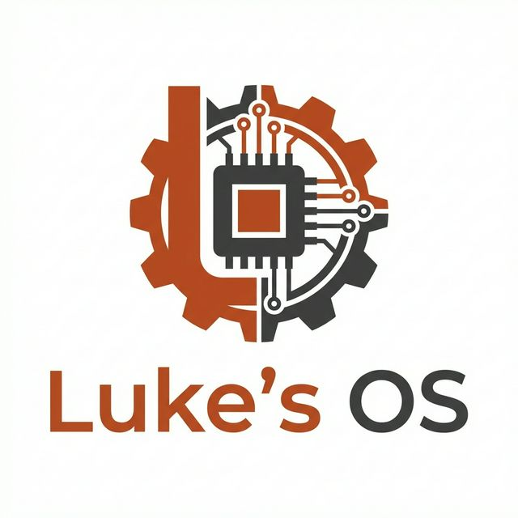

# Luke's OS

<p align="center">
  
</p>

**Luke's OS** is an educational, 64-bit x86 symmetric multiprocessing (SMP) hobby operating system developed in **Rust**. It explores modern operating system architecture principles — from bare-metal bootstrapping and multi-core AP bringup to high-performance memory allocators, preemptive multitasking, PCI enumeration, VirtIO block storage, and virtual file systems.

---

## Architecture & Subsystems

```
                                +---------------------------+
                                |  Luke's OS (SMP Edition)  |
                                +---------------------------+
                                              |
        +------------------+------------------+------------------+------------------+
        |                  |                  |                  |                  |
+---------------+  +---------------+  +---------------+  +---------------+  +---------------+
|  Multi-Core   |  | Memory Engine |  | Multitasking  |  | Console & IO  |  | Storage & VFS |
+---------------+  +---------------+  +---------------+  +---------------+  +---------------+
| • ACPI (MADT) |  | • O(1) Frames |  | • Preemptive  |  | • Framebuffer |  | • PCI Scanner |
| • LAPIC + IPI |  | • Contig. DMA |  |   Timer ISR   |  |   Text Console|  | • VirtIO-Blk  |
| • AP Tramp.   |  | • 4 MiB Heap  |  | • TicketLock  |  | • 16550 Serial|  | • VFS / RamFS |
| • Per-Core GDT|  | • Dynamic Grow|  | • Sleep Mutex |  | • PS/2 Keys   |  | • Sector I/O  |
+---------------+  +---------------+  +---------------+  +---------------+  +---------------+
```

### 1. Bootstrapping & Symmetric Multiprocessing (SMP)
- **Bootloader**: Built on `bootloader_api` (v0.11), supporting both **BIOS** (`rustos-bios.img`) and **UEFI** (`rustos-uefi.img`) boot modes.
- **ACPI Table Parser (`kernel/src/acpi.rs`)**: Scans RSDP and MADT (Multiple APIC Description Table) to discover Local APIC addresses and enumerate online CPU cores.
- **Local APIC (`kernel/src/apic.rs`)**: MSR-enabled LAPIC managing timer interrupts, spurious interrupts, and Inter-Processor Interrupts (IPIs).
- **AP Bringup Trampoline (`kernel/src/smp.rs`)**: Broadcasts INIT-SIPI-SIPI sequences to transition secondary cores from 16-bit real mode into 64-bit long mode via a low-memory trampoline page (`0x8000`).
- **Per-CPU Tracking**: Configures per-core GDT/TSS structures and `IA32_GS_BASE` for thread-local core state.

### 2. Memory Management Engine
- **O(1) Physical Frame Allocator (`kernel/src/memory.rs`)**:
  - Replaces linear scans with an intrusive free list and multi-region bump allocator.
  - Supports **contiguous multi-frame allocation** (`allocate_contiguous`) required for hardware DMA buffers.
  - Implements full frame deallocation (`deallocate_frame`, `deallocate_contiguous`).
  - Real-time diagnostics: `total_memory_bytes()`, `free_memory_bytes()`, `allocated_frames()`.
- **VirtIO DMA HAL (`kernel/src/virtio_hal.rs`)**: Zero-leak DMA allocator backed by contiguous frame allocations.
- **Dynamic Kernel Heap (`kernel/src/allocator.rs`)**:
  - Initial 4 MiB heap mapped at virtual address `0x4444_4444_0000`.
  - Supports runtime dynamic extension via `extend_heap(mapper, frame_allocator, bytes)`.
  - Diagnostics: `heap_size()`, `heap_used()`, `heap_free()`.

### 3. Synchronization & Multitasking
- **TicketLock (`kernel/src/sync.rs`)**: Fair FIFO ticket spinlock preventing core starvation across multi-core workloads.
- **SleepingMutex & WaitQueue (`kernel/src/sync.rs`)**: Blocking synchronization primitives that deschedule contending threads.
- **Preemptive Scheduler (`kernel/src/scheduler.rs`, `kernel/src/thread.rs`)**:
  - Interrupt-driven preemption via `timer_interrupt_asm` capturing full register state.
  - Safe deferred zombie reaping (`sched.dead`), preventing stack use-after-free on thread termination.
  - Sleeping thread queues via `scheduler::sleep(ticks)`.

### 4. Display, Input & Interactive Shell
- **Framebuffer Console (`kernel/src/vga.rs`)**: Pixel-rendered text console with custom 8x16 font, screen scrolling, backspace (`\x08`), `clear_screen()`, ASCII, and extended European characters (`ä`, `ö`, `ü`, `ß`, `€`, `°`).
- **Interrupt-Safe Keyboard Subsystem (`kernel/src/keyboard.rs`)**:
  - Decoupled PS/2 IRQ1 driver decoding scancodes into an interrupt-safe FIFO ring buffer.
  - Blocking and non-blocking input APIs (`read_char`, `read_line`) with cooperative yielding to the multi-core scheduler.
- **Interactive Kernel Shell (`kernel/src/shell.rs`)**:
  - Dedicated `"shell"` kernel task running interactive command-line interface.
  - Builtin commands: `help`, `clear`, `mem` (physical and heap statistics), `ps`/`threads` (active threads across cores), `lspci` (PCI device discovery), `ls`, `cat`, `touch`, `mkdir` (VFS navigation & file inspection), `echo`, `uname`.
- **Serial Logger (`kernel/src/serial.rs`)**: COM1 UART logger (`0x3F8`) allowing headless debugging and automated test logs via `serial_println!`.

### 5. Storage, Extensible VFS & Persistent LukeFs
- **PCI Bus Scanner (`kernel/src/pci.rs`)**: Configuration-space scanner discovering PCI peripherals and VirtIO devices.
- **VirtIO Block Driver (`kernel/src/virtio_blk.rs`)**: 512-byte sector block driver implementing `BlockDevice`.
- **Extensible Virtual File System (`kernel/src/vfs.rs`)**:
  - Global `MountTable` registry supporting root (`/`) and multiple mount points (`/disk`).
  - Path canonicalization with `normalize_path` resolving `.` and `..`.
  - Stdio-like `FileHandle` with `OpenFlags` (`read`, `write`, `create`, `truncate`, `append`) and `SeekFrom`.
  - Comprehensive filesystem abstraction ready for pluggable third-party drivers (`fat32`, `ext2`, `tarfs`).
- **RamFS (`kernel/src/ramfs.rs`)**: In-memory volatile filesystem mounted at `/` hosting `/tmp`, `/dev`, and `/proc`.
- **Persistent LukeFs (`kernel/src/lukefs.rs`)**:
  - Custom block-backed filesystem mounted persistently at `/disk` on the VirtIO block device.
  - Superblock verification, automatic formatting, allocation table management, and dynamic sector growth.

### 6. User Space, Process Isolation & Hardware-Accelerated Syscalls
- **Privilege Rings & TSS RSP0 (`kernel/src/gdt.rs`)**: User mode descriptors (DPL 3) with dynamic TSS `privilege_stack_table[0]` updates providing dedicated kernel stack recovery on Ring 3 transitions.
- **Per-Process Address Space Isolation (`kernel/src/process.rs`, `kernel/src/memory.rs`)**:
  - `Process` structure tracking `pid`, `pml4`, threads, and exit codes.
  - Per-process PML4 page tables (`memory::new_user_page_table`) isolating lower-half memory (`0..256`) while mirroring upper-half kernel space (`256..512`).
  - Preemptive `CR3` page table switching during scheduling context switches (`schedule_tick`).
  - Automatic frame deallocation on process termination (`free_user_page_table`).
- **FPU / SSE Hardware Support (`kernel/src/fpu.rs`, `kernel/src/thread.rs`)**:
  - Enabled SSE/FPU on BSP and AP cores (`CR0.EM=0`, `CR0.MP=1`, `CR4.OSFXSR=1`, `CR4.OSXMMEXCPT=1`, `fninit`).
  - 16-byte aligned 512-byte `FxState` per thread, eagerly saved and restored across thread preemption using `fxsave64` and `fxrstor64`.
- **Fast System Calls (`kernel/src/syscall.rs`)**:
  - `EFER.SCE`, `LSTAR`, `STAR`, and `FMASK` MSR configuration for low-overhead `SYSCALL`/`SYSRET` transitions.
  - Naked assembly entry (`syscall_entry`) with `swapgs` per-CPU stack switching and full user register preservation.
  - POSIX-compatible system call numbers: `sys_yield` (0), `sys_exit` (1), `sys_write` (2), `sys_read` (3), `sys_open` (4), `sys_close` (5), `sys_getpid` (6), `sys_uname` (7), `sys_spawn` (8), `sys_wait` (9), `sys_sleep` (10), `sys_time` (11), `sys_mmap_anon` (12).
- **ELF64 Executable Loader (`kernel/src/elf.rs`)**:
  - Parses ELF64 binary format, validates magic, headers, and segment virtual addresses.
  - Maps `PT_LOAD` segments directly into the target process's isolated PML4 table.
  - Spawns ring-3 processes as preemptive scheduler-managed threads with dedicated kernel stack switching.


### 7. Graphical User Interface (GUI), Window Compositor & User SDK
- **Display & BackBuffer Engine (`kernel/src/gfx/`)**:
  - `Display` abstraction over bootloader framebuffer memory supporting RGB and BGR pixel formats.
  - Double-buffered `BackBuffer` backed by contiguous physical frames with row-wise fast bitblt transfers and bounding-box dirty damage tracking (`present`).
  - Integration with `embedded-graphics` (v0.8) implementing `DrawTarget` for software rendering.
- **PS/2 Mouse Driver (`kernel/src/mouse.rs`)**:
  - i8042 auxiliary device streaming mode enabled with packet assembly and signed delta computation.
  - Unmasked IRQ12 on slave PIC and IRQ2 cascade on master PIC.
  - Pushes normalized relative movement and click events to the unified input queue.
- **Unified Input Queue (`kernel/src/input.rs`)**:
  - Interrupt-safe FIFO ring buffer for combined keyboard and mouse events (`MouseMove`, `MouseButton`, `Key`, `Scroll`).
- **Kernel Window Compositor (`kernel/src/gfx/wm.rs`)**:
  - Dedicated `"wm"` scheduler thread running desktop composition.
  - Window frame decorations: title bars, active/inactive focus highlighting, close buttons, borders, and per-window pixel buffers.
  - Interactive window movement by clicking and dragging title bars.
  - Desktop taskbar with interactive Start menu, window task tabs, and real-time uptime clock.
  - Software mouse cursor rendering (12x18 arrow pointer) with pixel restoration.
  - Shell terminal runs inside a dedicated desktop window ("Terminal") with `gui`, `text`, and `about` commands.
- **Graphics System Calls (`kernel/src/syscall.rs`, `docs/ABI.md`)**:
  - `SYS_WIN_CREATE` (20): creates managed window with dedicated shared pixel memory surface.
  - `SYS_WIN_BUFFER` (21): returns user virtual address of window pixel buffer.
  - `SYS_WIN_PRESENT` (22): flushes damaged rectangles into window content and marks dirty for compositor bitblt.
  - `SYS_WIN_POLL` (23): polls non-blocking input events (`KeyDown`, `KeyUp`, `Char`, `MouseMove`, `MouseDown`, `MouseUp`, `Close`, `FocusIn`, `FocusOut`).
  - `SYS_WIN_DESTROY` (24): closes window and cleans up mappings; process exit automatically tears down all owned windows.
- **User SDK & Applications (`user/`)**:
  - `user/libluke`: `no_std` runtime with `_start`, fast syscall wrappers, print macros, and bump allocator using `SYS_MMAP_ANON`.
  - `user/luke-gui`: high-level window abstraction with `embedded-graphics` `DrawTarget` implementation.
  - `user/apps/hello`: Ring 3 user process demonstration printing PID.
  - `user/apps/clock`: graphical digital clock displaying uptime and updating in real-time.
  - `user/apps/paint`: interactive painting application with mouse cursor drawing.
  - `user/apps/files`: graphical file browser displaying files in `/bin`.
  - Pre-populated `/bin` directory in RamFS (`/bin/hello`, `/bin/clock`, `/bin/paint`, `/bin/files`) executable via shell `exec` or the desktop Start menu.


---

## Project Structure

```
lukes-os/
├── .cargo/
│   └── config.toml          # build-std flags, target configuration & MSVC env
├── kernel/                  # Bare-metal x86_64 SMP kernel (no_std)
│   ├── Cargo.toml
│   └── src/
│       ├── main.rs          # Kernel entry point and SMP bringup sequence
│       ├── acpi.rs          # ACPI RSDP & MADT table parser
│       ├── allocator.rs     # 4 MiB dynamic heap allocator & diagnostics
│       ├── apic.rs          # Local APIC driver & IPI handling
│       ├── block.rs         # Unified BlockDevice trait
│       ├── elf.rs           # ELF64 executable loader & user-mode launcher
│       ├── gdt.rs           # Per-core GDT, TSS, and IST setup
│       ├── interrupts.rs    # IDT handlers, LAPIC timer vector, PIC mask
│       ├── keyboard.rs      # PS/2 scancode decoder & ring buffer queue
│       ├── lukefs.rs        # Persistent block-backed filesystem driver
│       ├── memory.rs        # O(1) contiguous frame allocator & paging
│       ├── pci.rs           # PCI bus scanner
│       ├── ramfs.rs         # In-memory filesystem implementation
│       ├── scheduler.rs     # Preemptive timer ISR & scheduler
│       ├── serial.rs        # COM1 16550 UART driver & macros
│       ├── shell.rs         # Interactive kernel shell task & builtins
│       ├── smp.rs           # AP trampoline, PerCpu, and multi-core boot
│       ├── sync.rs          # TicketLock, WaitQueue & SleepingMutex
│       ├── syscall.rs       # Fast MSR-based SYSCALL/SYSRET dispatcher
│       ├── thread.rs        # Thread state, stack context & switch_context
│       ├── vfs.rs           # VFS abstraction traits (Inode, FileSystem)
│       ├── vga.rs           # Framebuffer text console with bitmap font
│       ├── virtio_blk.rs    # VirtIO block device driver
│       └── virtio_hal.rs    # DMA HAL for virtio-drivers
├── runner/                  # Host launcher and disk packaging tool
│   ├── build.rs             # Builds BIOS/UEFI images via bootloader crate
│   ├── Cargo.toml
│   └── src/
│       └── main.rs          # Spawns QEMU with -smp 4 and disk devices
├── resources/               # Static assets & logos (not deleted by cargo clean)
│   └── img/
│       └── lukes_os_logo.png
├── CHANGELOG.md             # Development milestones & progress tracking
├── Cargo.toml               # Workspace configuration
└── rust-toolchain.toml      # Nightly toolchain specification
```

---

## Getting Started

### Prerequisites

1. **Rust Nightly**:
   ```sh
   rustup toolchain install nightly
   rustup default nightly
   rustup component add rust-src llvm-tools-preview
   rustup target add x86_64-unknown-none
   ```

2. **QEMU**:
   - **Windows**: Install via `winget install SoftwareFreedomConservancy.QEMU` or download from [qemu.org](https://www.qemu.org/download/#windows).
   - **Linux**: `sudo apt install qemu-system-x86`
   - **macOS**: `brew install qemu`

---

### Building and Running

#### 1. One-Step Run (Recommended)

To build the SMP kernel, package boot images, and launch QEMU with 4 CPU cores:

```sh
cargo run
```

#### 2. Manual Kernel Compilation

To compile the bare-metal kernel:

```sh
cargo build --target x86_64-unknown-none -p kernel
```

To run a fast workspace type check:

```sh
cargo check
```

---

## Progress Tracking

For full milestone details, architectural refactors, and future roadmap phases, see:
👉 **[CHANGELOG.md](CHANGELOG.md)**

---

## License

This project is licensed under the MIT License - see the [LICENSE](LICENSE) file for details.
